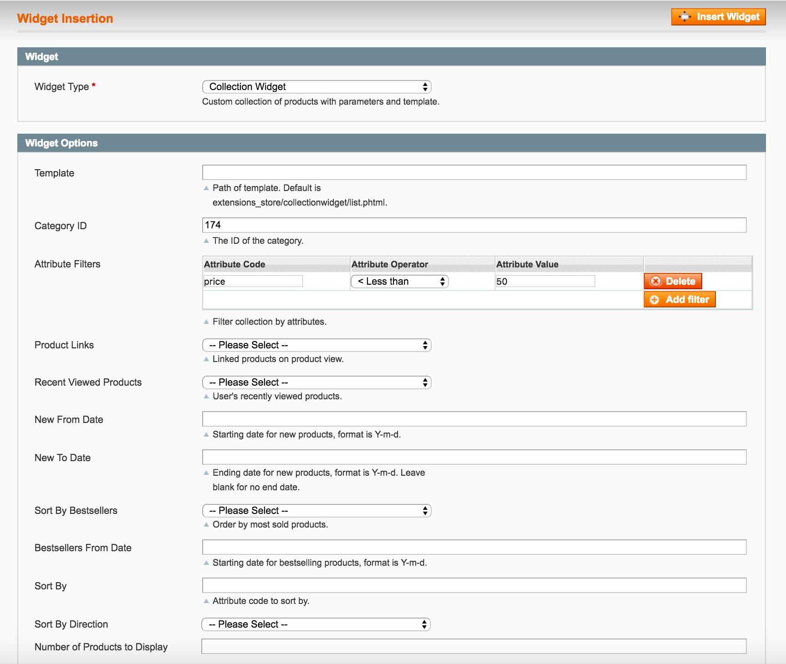

Collection Widget
=================
Get a custom collection of products in a widget configuration for display in a static block, 
CMS page or layout update.

Description
-----------
Collection Widget lets you customize a collection of products in a widget configuration
for display in CMS page, static block or declared in a layout update. For example, you want 
to display a collection of products from a category having price less than $50:

Install
-------
Modman:

<pre>
modman clone https://github.com/ExtensionsStore/CollectionWidget
</pre>

Composer:

<pre>
{
    "require": {
        "magento-hackathon/magento-composer-installer": "dev-master",
    	"extensions-store/collectionwidget" : "dev-master"
    },
    "repositories" : [
    	{
    		"type" : "vcs",
    		"url" : "https://github.com/ExtensionsStore/CollectionWidget"
    	}  	
    ],
    "extra": {
        "magento-root-dir": "./html",
        "magento-deploystrategy": "copy",
        "magento-force" : true,
        "with-bootstrap-patch" : false
    }
}

</pre>

Support
-------
As this is a free extension, no support or guarantee is implied or provided. 
However, I can be contacted at https://www.extensions-store.com/support.html. 
Paid support including installation, configuration and custom development is 
available. Also, further development and updates are dependent on client support.
